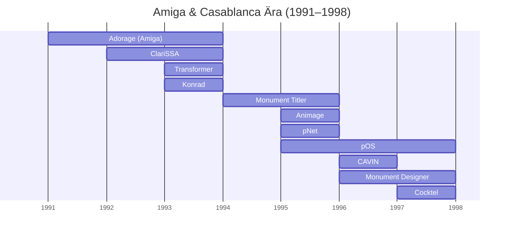
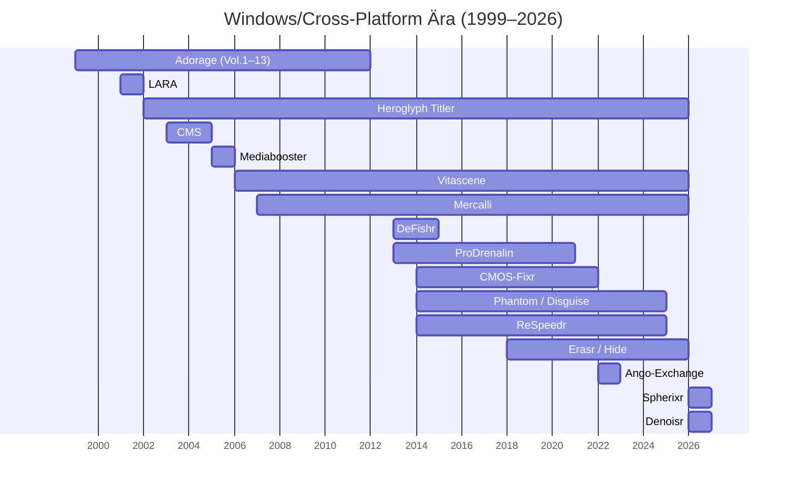

  
  

# proDAD Produkte über die Jahre

> This timeline provides an overview of proDAD's product history, spanning from the Amiga & Casablanca Era to the Windows/Cross-Platform Era.

[Adorage](Adorage.de-DE.md),
[ClariSSA](ClariSSA.de-DE.md),
[Transformer](Transformer.de-DE.md),
[Konrad](Konrad.de-DE.md),
[Monument Titler](MonumentTitler.de-DE.md),
[Animage](Animage.de-DE.md),
[pNet](pNet.de-DE.md),
[CAVIN](CAVIN.de-DE.md),
[Monument Designer](MonumentDesigner.de-DE.md),
[pOS](pOS.de-DE.md),
[Cocktel](Cocktel.de-DE.md)

---

[Adorage](Adorage.de-DE.md),
[Heroglyph Titler](HeroglyphTitler.de-DE.md),
[Vitascene](Vitascene.de-DE.md),
[Mercalli](Mercalli.de-DE.md),
[DeFishr](DeFishr.de-DE.md),
[ProDrenalin](ProDrenalin.de-DE.md),
[CMOS-Fixr](CMOS-Fixr.de-DE.md),
[Disguise / Phantom](Disguise.de-DE.md),
[ReSpeedr](ReSpeedr.de-DE.md),
[Hide / Erasr](Hide.de-DE.md),
[Spherixr](Spherixr.de-DE.md),
[Denoisr](Denoisr.de-DE.md)

---

## Amiga & Casablanca Ära (1991–1998)

| Year | Product                   | Notice                                |
|------|---------------------------|---------------------------------------|
| 1991 | [Adorage](Adorage.de-DE.md)       | Die revolutionäre Effektsuite für den Amiga. Bot strukturierte Masken- und Partikeleffekte sowie die einzigartige SSA-Animation für extrem flüssige, ruckelfreie Übergänge.|
| 1992 | [ClariSSA v1](ClariSSA.de-DE.md) | Konvertiert Standard-Animationen in das performante SSA-Format (Super-Smooth-Animation) für eine bis dahin unerreicht flüssige Wiedergabe auf dem Amiga. |
|      | [Adorage v2](Adorage.de-DE.md)    | Upgrade mit höherer Rendergeschwindigkeit durch optimierte Assembler-Routinen und erweiterter Effektbibliothek. |
| 1993 | [ClariSSA v2](ClariSSA.de-DE.md) | Verbesserte Version des SSA-Konverters mit optimierter Performance und erweiterten Funktionen. |
|      | [ClariSSA v3](ClariSSA.de-DE.md) | Einführung der *Transformer*-Engine für hochwertige Farb- und Formatvorbereitung von Animationssequenzen. Direct-from-HD Streaming für extrem lange Szenen. |
|      | [Transformer](Transformer.de-DE.md) | Low-AI Farbquantisierer für verlustarme Farbreduktion und Konvertierung zwischen Amiga-Bildformaten. |
|      | [Adorage AGA](Adorage.de-DE.md)                    | Version von Adorage für AGA-Systeme mit erweiterter Farbpalette und höherer Bildqualität. |
|      | [Konrad](Konrad.de-DE.md)                          | Bildkonverter für Adorage zur optimalen Vorbereitung von Grafiken und Masken. |
| 1994 | [Monument Titler v1](MonumentTitler.de-DE.md)     | Komplett-Titler mit Editor, Animator und Player auf einer Oberfläche. Bietet Genlock-Unterstützung, Live-Timing und integrierte Transformer-Technologie. |
| 1995 | [Animage](Animage.de-DE.md)                        | Echtzeit-fähiges Multi-Layer-Compositing-System. Erstes proDAD-Produkt mit vollständiger Undo/Redo-Unterstützung und integriertem Partikel-Generator.  |
|      | [Monument Titler v2](MonumentTitler.de-DE.md)     | Verbesserte Version des Monument Titlers mit erweiterten Animations- und Effektmöglichkeiten. |
|      | [PNet](pNET.de-DE.md)                              | Extrem einfache Peer-to-Peer-Netzwerklösung über serielles Kabel. Bietet Laufwerksspiegelung, Remote-CLI, Chat und Debugging-Schnittstelle. |
| 1996 | [Monument Designer v1](MonumentDesigner.de-DE.md) | Für Amiga und Draco (MacroSystem). Bietet umfassende Design- und Animationswerkzeuge für professionelle Videoproduktionen. |
|      | CAVIN                     | Videobearbeitung mit direkter Steuerung von Camcordern. |
| 1997 | [pOS](pOS.de-DE.md)                       | Proprietäres Betriebssystem für den Amiga. |
|      | [Monument Designer v2](MonumentDesigner.de-DE.md)      | Erweiterte Version des Monument Designers mit zusätzlichen Design- und Animationsfunktionen. |
|      | [Cocktel](Cocktel.de-DE.md)                   | Pionierhafte Live-Videotelefonie-Software für den Amiga über analoge Telefonleitungen mit 28,8–33,6 kbit/s. |
| 1998 | [Monument Designer](MonumentDesigner.de-DE.md)         | Für Casablanca (MacroSystem). Nahtlose System-Integration für TV-orientierte Bedienung und maximale Stabilität. |

## Windows PC & Cross-Platform Ära (1999–Heute)

| Year | Product                   | Notice                                |
|------|---------------------------|---------------------------------------|
| 1999 | [Adorage Vol.1](Adorage.de-DE.md)             | Erste Windows-Version. Fokus auf klassische Universalüberblendungen, Masken und Rahmeneffekte. |
| 2000 | [Adorage Vol.2](Adorage.de-DE.md)             | Erweiterung um Licht-, Partikel- und Laser-Effekte. |
|      | [Adorage Vol.3](Adorage.de-DE.md)             | Spezialisierung auf thematische Übergänge für Hochzeiten, Feiern und Familienereignisse. |
| 2001 | [Adorage Vol.4](Adorage.de-DE.md)             | Schwerpunkt auf Urlaubs-, Reise- und Naturaufnahmen. |
|      | [Adorage Vol.5](Adorage.de-DE.md)             | Fokus auf Diamanten-, Glas- und 3D-Container-Effekte. |
|      | LARA                      | Einfaches Tool zur Lokalisierung von Websites.        |
| 2002 | [Heroglyph Titler v1](HeroglyphTitler.de-DE.md) | Professionelle Lösung für Titel, Untertitel, Handschrift, Reiseroutenanimation und Trailer mit über 400 Vorlagen. |
|      | [Adorage Vol.6](Adorage.de-DE.md)             | Spezialisiert auf dynamische Lichtstrahlen, Blendenflecke (Lens Flares) und Glitzereffekte. |
| 2003 | CMS                       | Content-Management-System für Regierungsbehörden. |
|      | [Adorage Vol.7](Adorage.de-DE.md)             | Fokus auf Romantik-, Hochzeits- und Jubiläumsthemen mit detaillierten Maskenüberlagerungen. |
| 2004 | [Heroglyph Titler v2](HeroglyphTitler.de-DE.md)       | Verbesserte Benutzeroberfläche und zusätzliche Vorlagen für professionelle Titelgestaltung. |
|      | [Adorage Vol.8](Adorage.de-DE.md)             | Mehr als 1.000 Effekte mit dem Schwerpunkt auf Sport-, Action- und Dynamikblenden. |
| 2005 | [Heroglyph Titler v2.5](HeroglyphTitler.de-DE.md)     | Zwischenversion mit weiteren Verbesserungen. |
|      | Mediabooster              | Content-Management-System für Video-Websites. |
|      | [Adorage Vol.9](Adorage.de-DE.md)             | Spezialisierung auf Partikeleffekte (Feuer, Wasser, Luft, Sterne). |
| 2006 | [Vitascene v1 SAL](Vitascene.de-DE.md)          | Umfangreiche Suite aus hochwertigen Übergangseffekten, Lichteffekten und cineastischen Farbfiltern mit GPU-Beschleunigung. |
|      | [Vitascene v1 Plugins](Vitascene.de-DE.md)      | Plug-in-Version für führende Schnittsysteme. |
| 2007 | [Heroglyph Titler v2.6](HeroglyphTitler.de-DE.md)     | Weitere Verbesserungen und neue Vorlagen für die Titelgestaltung. |
|      | [Mercalli Plugins v1](Mercalli.de-DE.md)       | Erste Version der Plug-ins für die Videostabilisierung. |
|      | [Vitascene v1 Pinnacle](Vitascene.de-DE.md)     | Bundle mit Pinnacle Studio.           |
|      | [Vitascene v1 MAGIX DELUXE](Vitascene.de-DE.md) | Bundle mit MAGIX DELUXE.            |
| 2008 | [Adorage Vol.10](Adorage.de-DE.md)            | "HD-Effekte Package" – Erstes Paket, das vollständig auf HD-Videoauflösungen optimiert wurde. |
| 2009 | [Adorage Vol.11](Adorage.de-DE.md)            | Fokus auf weltweite Reiseziele, Globus- und Karteneffekte sowie kulturelle Motive. |
|      | [Mercalli v1.5 SDK](Mercalli.de-DE.md)         | SDK-Version für Entwickler. |
|      | [Mercalli v1.5 Plugins](Mercalli.de-DE.md)     | FinalCut, Adobe Premiere Pro und andere Schnittsysteme. |
| 2010 | [Adorage Vol.12](Adorage.de-DE.md)            | Umfassendes Universalpaket mit über 2.000 Effekten für Feiern, Dokumentationen und Videoblogs. |
|      | [Heroglyph Titler v4](HeroglyphTitler.de-DE.md) | Verbesserte Benutzeroberfläche und zusätzliche Vorlagen für die professionelle Titelgestaltung. |
|      | [Mercalli v1 Pinnacle](Mercalli.de-DE.md)      | Bundle mit Pinnacle Studio.           |
|      | [Mercalli v1 Easy](Mercalli.de-DE.md)          | Einfache Version für die schnelle Videostabilisierung. |
|      | [Mercalli v1 DS Plugin](Mercalli.de-DE.md)     | Direct-Show-Integration.				|
| 2011 | [Adorage Vol.13](Adorage.de-DE.md)            | Das große Finale der Volume-Reihe ("HD All-in-One Package") mit mehreren Tausend Effekten in nativer 64-Bit-Architektur. |
|      | [Mercalli v2 Plugins](Mercalli.de-DE.md)       | Neue CMOS-Verzerrungskorrektur.        |
|      | [Mercalli v2 Easy](Mercalli.de-DE.md)          | Einfache Version für die schnelle Videostabilisierung. |
|      | [Heroglyph Route](HeroglyphTitler.de-DE.md)           | Bundle für Corel VideoStudio.          |
|      | [Heroglyph Script](HeroglyphTitler.de-DE.md)          | Bundle für Corel VideoStudio.          |
|      | [Vitascene v1 EDIUS](Vitascene.de-DE.md)        | Bundle für EDIUS. |
|      | [Vitascene v1 Avid Studio](Vitascene.de-DE.md)  | Bundle für Avid Studio. |
| 2012 | [Mercalli v2 SAL](Mercalli.de-DE.md)           | Standalone-Version. |
| 2013 | [Vitascene v2](Vitascene.de-DE.md)              | Umfangreiche Suite aus hochwertigen Übergangseffekten, Lichteffekten und cineastischen Farbfiltern mit GPU-Beschleunigung. |
|      | [DeFishr v1 SAL](DeFishr.de-DE.md)            | Linsenentzerrung: Korrigiert fisheye-bedingte Wölbungen von Action-Cams vollautomatisch über mathematische Linsenprofile. |
|      | [ProDrenalin v1](ProDrenalin.de-DE.md)            | All-in-One-Lösung für Action-Cams: Entfernt Fischaugeneffekt, stabilisiert, korrigiert Rolling Shutter und Farbe. |
| 2014 | [Mercalli v3 SAL](Mercalli.de-DE.md)           | Neue Standalone-Version. |
|      | [Mercalli v3 Plugins](Mercalli.de-DE.md)       | Neue Plugins für die Videostabilisierung. |
|      | [Phantom v1](Disguise.de-DE.md)                |                                       |
|      | [ReSpeedr v1](ReSpeedr.de-DE.md)               | Extrem flüssige Zeitlupen und Zeitraffer durch Frames-Blending und Optischer-Fluss-Analyse. |
|      | [CMOS-Fixr v1](CMOS-Fixr.de-DE.md)              | Patent No. 10136065                   |
|      | [DeFishr v1 MAGIX Deluxe](DeFishr.de-DE.md)   | Bundle mit MAGIX Deluxe.              |
|      | [Vitascene v2 Sony Vegas](Vitascene.de-DE.md)   | Bundle für Sony Vegas.               |
| 2015 | [Phantom v1.4](Disguise.de-DE.md)              | Schneller und robuster Objektnachverfolger.        |
| 2016 | [ProDrenalin v2](ProDrenalin.de-DE.md)            | Neue Version der All-in-One-Lösung für Action-Cams. |
|      | [Mercalli v4 SAL](Mercalli.de-DE.md)           | Verbesserte Stabilisierung und neue CMOS-Fixr-Funktion. |
|      | [Mercalli v4 Plugins](Mercalli.de-DE.md)       | Neue Plugins für die Videostabilisierung.                                       |
|      | [Phantom v1.5](Disguise.de-DE.md)              |                                       |
| 2017 | [Vitascene v3](Vitascene.de-DE.md)              | Neue Version mit noch mehr Effekten und Templates. |
|      | [Mercalli Mac OSX Plugins](Mercalli.de-DE.md)  | Erstmals Plug-ins für Mac OSX. |
|      | [Phantom v1.6 S3D](Disguise.de-DE.md)          | Unterstützung für sphärische binokulare Videos. |
| 2018 | [Erasr v1](Hide.de-DE.md)                  | Anonymisierung und Objektentfernung: Entfernt unerwünschte Objekte nahtlos aus bewegten Videobildern. |
|      | [Phantom](Disguise.de-DE.md)                   | Bundle für Polizeibehörden.         |
|      | [ProDrenalin](ProDrenalin.de-DE.md)               | Bundle für Polizeibehörden.         |
|      | [Mercalli](Mercalli.de-DE.md)                  | Bundle für Polizeibehörden.         |
|      | [Phantom v1.7 Re-Mosaic](Disguise.de-DE.md)    | Erkennt Mosaike automatisch und erstellt Zeitachsen. |
| 2019 | [Mercalli NUC](Mercalli.de-DE.md)              | Für medizinische Anwendungen.              |
|      | [Phantom v1.8 Faces](Disguise.de-DE.md)        | Erkennt automatisch Gesichter und Objekte und erstellt Zeitachsen. |
| 2020 | [Vitascene v4](Vitascene.de-DE.md)              | Neue Version inkl. Seamless-Transitions. |
|      | [ProDrenalin v3](ProDrenalin.de-DE.md)             | Super-Lupe und gerichtsverwertbares Protokoll |
|      | [Mercalli v5 SAL](Mercalli.de-DE.md)					 | Weitere Verbesserungen der Videostabilisierung. |
|      | [Mercalli v5 Plugins](Mercalli.de-DE.md)			 | Neue Plugins für die Videostabilisierung. |
|      | [Mercalli PicEnhancer](Mercalli.de-DE.md)      | Verbessert die Bildqualität. |
|      | [Mercalli RT](Mercalli.de-DE.md)               | Echtzeit-Stabilisierung ohne vorherige Analyse. |
| 2021 | [Disguise v1.5](Disguise.de-DE.md)             | Das Phantom wurde umbenannt. Verpixelt Gesichter und Nummernschilder präzise. |
|      | [Hide v1.5](Hide.de-DE.md)                 | Das Erasr wurde umbenannt. Entfernt unerwünschte Objekte nahtlos aus Videos.   |
| 2022 | Ango-Exchange             | Datenaustausch-Tool. |
|      | [Mercalli v6 SAL](Mercalli.de-DE.md)					 | Weitere Verbesserungen der Videostabilisierung und CMOS-Korrektur. Zusätzlich Bild- und Farboptimierung. |
|      | [Mercalli v6 Plugins](Mercalli.de-DE.md)       | Neue Plugins für die Videostabilisierung. |
|      | [Disguise v2](Disguise.de-DE.md)               | Überarbeitetes UI mit verbesserter Benutzerfreundlichkeit und neuen Funktionen. |
|      | [ReSpeedr v2](ReSpeedr.de-DE.md)               | Verbesserte Zeitlupen- und Zeitraffereffekte. |
|      | [Vitascene v5](Vitascene.de-DE.md)              | Neue Version mit über 1.700 Effekten, Glitch-Effekten und 8K-Unterstützung. |
|      | [Mercalli CLI](Mercalli.de-DE.md)              | Kommandozeilen-Interface für die Videostabilisierung. |
|      | [Mercalli Linux SDK](Mercalli.de-DE.md)        | Software Development Kit für Linux zur Integration der Videostabilisierung. |
|      | [Hide v2](Hide.de-DE.md)                   | Neue Version mit verbesserten Algorithmen zur Objektentfernung. |
|      | [Vitascene v6 OFX](Vitascene.de-DE.md)          | OFX-Version für professionelle NLEs. |
| 2026 | [Heroglyph Titler v5](HeroglyphTitler.de-DE.md)       | Neue Version mit erweiterten Funktionen für Titel, Handschrift und Routenanimation. |
|      | [Spherixr v1](Spherixr.de-DE.md)               | Plugin für sphärische 360°-Videos. |
|      | [Denoisr v1](Denoisr.de-DE.md)                | Plugin für (RT) Rauschunterdrückung in Videos. |

## Links
- [Startseite](README.de-DE.md)
- [proDAD Website](https://www.prodad.com/)
