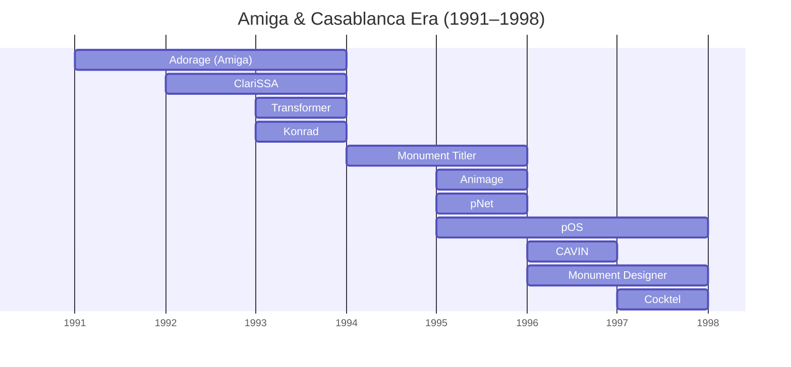
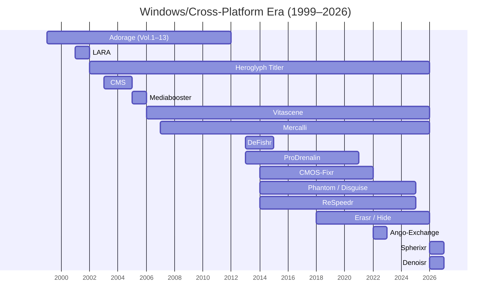

  
  

# proDAD Products Through the Years

> This timeline provides an overview of proDAD's product history, spanning from the Amiga & Casablanca Era to the Windows/Cross-Platform Era.

[Adorage](Adorage.md),
[ClariSSA](ClariSSA.md),
[Transformer](Transformer.md),
[Konrad](Konrad.md),
[Monument Titler](MonumentTitler.md),
[Animage](Animage.md),
[pNet](pNet.md),
[CAVIN](CAVIN.md),
[Monument Designer](MonumentDesigner.md),
[pOS](pOS.md),
[Cocktel](Cocktel.md)

---

[Adorage](Adorage.md),
[Heroglyph Titler](HeroglyphTitler.md),
[Vitascene](Vitascene.md),
[Mercalli](Mercalli.md),
[DeFishr](DeFishr.md),
[ProDrenalin](ProDrenalin.md),
[CMOS-Fixr](CMOS-Fixr.md),
[Disguise / Phantom](Disguise.md),
[ReSpeedr](ReSpeedr.md),
[Hide / Erasr](Hide.md),
[Spherixr](Spherixr.md),
[Denoisr](Denoisr.md)

---

## Amiga & Casablanca Era (1991–1998)

| Year | Product                   | Notice                                |
|------|---------------------------|---------------------------------------|
| 1991 | [Adorage](Adorage.md)       | The revolutionary effects suite for the Amiga. Offered structured mask and particle effects as well as the unique SSA animation for extremely smooth, judder-free transitions. |
| 1992 | [ClariSSA v1](ClariSSA.md) | Converts standard animations into the high-performance SSA format (Super-Smooth Animation) for playback on the Amiga that was unprecedentedly smooth at the time. |
|      | [Adorage v2](Adorage.md)    | Upgrade with faster rendering thanks to optimized assembler routines and an expanded effects library. |
| 1993 | [ClariSSA v2](ClariSSA.md) | Improved version of the SSA converter with optimized performance and expanded features. |
|      | [ClariSSA v3](ClariSSA.md) | Introduction of the *Transformer* engine for high-quality color and format preparation of animation sequences. Direct-from-HD streaming for extremely long scenes. |
|      | [Transformer](Transformer.md) | Low-AI color quantizer for low-loss color reduction and conversion between Amiga image formats. |
|      | [Adorage AGA](Adorage.md)                    | Version of Adorage for AGA systems with an expanded color palette and higher image quality. |
|      | [Konrad](Konrad.md)                          | Image converter for Adorage for optimal preparation of graphics and masks. |
| 1994 | [Monument Titler v1](MonumentTitler.md)     | Complete titler with editor, animator, and player in one interface. Offers genlock support, live timing, and integrated Transformer technology. |
| 1995 | [Animage](Animage.md)                        | Real-time-capable multi-layer compositing system. First proDAD product with full undo/redo support and an integrated particle generator.  |
|      | [Monument Titler v2](MonumentTitler.md)     | Improved version of Monument Titler with expanded animation and effect capabilities. |
|      | [pNet](pNET.md)                              | Extremely simple peer-to-peer network solution over a serial cable. Offers drive mirroring, remote CLI, chat, and debugging interface. |
| 1996 | [Monument Designer v1](MonumentDesigner.md) | For Amiga and Draco (MacroSystem). Offers comprehensive design and animation tools for professional video productions. |
|      | CAVIN                     | Video editing with direct control of camcorders. |
| 1997 | [pOS](pOS.md)                       | Proprietary operating system for the Amiga. |
|      | [Monument Designer v2](MonumentDesigner.md)      | Expanded version of Monument Designer with additional design and animation features. |
|      | [Cocktel](Cocktel.md)                   | Pioneering live video telephony software for the Amiga over analog telephone lines at 28.8–33.6 kbit/s. |
| 1998 | [Monument Designer](MonumentDesigner.md)         | For Casablanca (MacroSystem). Seamless system integration for TV-oriented operation and maximum stability. |

## Windows PC & Cross-Platform Era (1999–Today)

| Year | Product                   | Notice                                |
|------|---------------------------|---------------------------------------|
| 1999 | [Adorage Vol.1](Adorage.md)             | First Windows version. Focus on classic universal transitions, masks, and frame effects. |
| 2000 | [Adorage Vol.2](Adorage.md)             | Expansion with light, particle, and laser effects. |
|      | [Adorage Vol.3](Adorage.md)             | Specialization in thematic transitions for weddings, celebrations, and family events. |
| 2001 | [Adorage Vol.4](Adorage.md)             | Focus on vacation, travel, and nature footage. |
|      | [Adorage Vol.5](Adorage.md)             | Focus on diamond, glass, and 3D container effects. |
|      | LARA                      | Simple tool for localizing websites.        |
| 2002 | [Heroglyph Titler v1](HeroglyphTitler.md) | Professional solution for titles, subtitles, handwriting, route animation, and trailers with over 400 templates. |
|      | [Adorage Vol.6](Adorage.md)             | Specialized in dynamic light rays, lens flares, and glitter effects. |
| 2003 | CMS                       | Content management system for government agencies. |
|      | [Adorage Vol.7](Adorage.md)             | Focus on romance, wedding, and anniversary themes with detailed mask overlays. |
| 2004 | [Heroglyph Titler v2](HeroglyphTitler.md)       | Improved user interface and additional templates for professional title design. |
|      | [Adorage Vol.8](Adorage.md)             | More than 1,000 effects with a focus on sports, action, and dynamic transitions. |
| 2005 | [Heroglyph Titler v2.5](HeroglyphTitler.md)     | Interim version with further improvements. |
|      | Mediabooster              | Content management system for video websites. |
|      | [Adorage Vol.9](Adorage.md)             | Specialization in particle effects (fire, water, air, stars). |
| 2006 | [Vitascene v1 SAL](Vitascene.md)          | Comprehensive suite of high-quality transition effects, light effects, and cinematic color filters with GPU acceleration. |
|      | [Vitascene v1 Plugins](Vitascene.md)      | Plug-in version for leading editing systems. |
| 2007 | [Heroglyph Titler v2.6](HeroglyphTitler.md)     | Further improvements and new templates for title design. |
|      | [Mercalli Plugins v1](Mercalli.md)       | First version of the plug-ins for video stabilization. |
|      | [Vitascene v1 Pinnacle](Vitascene.md)     | Bundle with Pinnacle Studio.           |
|      | [Vitascene v1 MAGIX DELUXE](Vitascene.md) | Bundle with MAGIX DELUXE.            |
| 2008 | [Adorage Vol.10](Adorage.md)            | "HD Effects Package" – First package fully optimized for HD video resolutions. |
| 2009 | [Adorage Vol.11](Adorage.md)            | Focus on worldwide travel destinations, globe and map effects, and cultural motifs. |
|      | [Mercalli v1.5 SDK](Mercalli.md)         | SDK version for developers. |
|      | [Mercalli v1.5 Plugins](Mercalli.md)     | Final Cut, Adobe Premiere Pro, and other editing systems. |
| 2010 | [Adorage Vol.12](Adorage.md)            | Comprehensive universal package with over 2,000 effects for celebrations, documentaries, and video blogs. |
|      | [Heroglyph Titler v4](HeroglyphTitler.md) | Improved user interface and additional templates for professional title design. |
|      | [Mercalli v1 Pinnacle](Mercalli.md)      | Bundle with Pinnacle Studio.           |
|      | [Mercalli v1 Easy](Mercalli.md)          | Easy version for quick video stabilization. |
|      | [Mercalli v1 DS Plugin](Mercalli.md)     | DirectShow integration.				|
| 2011 | [Adorage Vol.13](Adorage.md)            | The grand finale of the Volume series ("HD All-in-One Package") with several thousand effects in native 64-bit architecture. |
|      | [Mercalli v2 Plugins](Mercalli.md)       | New CMOS distortion correction.        |
|      | [Mercalli v2 Easy](Mercalli.md)          | Easy version for quick video stabilization. |
|      | [Heroglyph Route](HeroglyphTitler.md)           | Bundle for Corel VideoStudio.          |
|      | [Heroglyph Script](HeroglyphTitler.md)          | Bundle for Corel VideoStudio.          |
|      | [Vitascene v1 EDIUS](Vitascene.md)        | Bundle for EDIUS. |
|      | [Vitascene v1 Avid Studio](Vitascene.md)  | Bundle for Avid Studio. |
| 2012 | [Mercalli v2 SAL](Mercalli.md)           | Standalone version. |
| 2013 | [Vitascene v2](Vitascene.md)              | Comprehensive suite of high-quality transition effects, light effects, and cinematic color filters with GPU acceleration. |
|      | [DeFishr v1 SAL](DeFishr.md)            | Lens correction: Automatically corrects fisheye-related distortion from action cams using mathematical lens profiles. |
|      | [ProDrenalin v1](ProDrenalin.md)            | All-in-one solution for action cams: Removes fisheye effect, stabilizes, corrects rolling shutter, and color. |
| 2014 | [Mercalli v3 SAL](Mercalli.md)           | New standalone version. |
|      | [Mercalli v3 Plugins](Mercalli.md)       | New plug-ins for video stabilization. |
|      | [Phantom v1](Disguise.md)                |                                       |
|      | [ReSpeedr v1](ReSpeedr.md)               | Extremely smooth slow motion and time-lapse through frame blending and optical flow analysis. |
|      | [CMOS-Fixr v1](CMOS-Fixr.md)              | Patent No. 10136065                   |
|      | [DeFishr v1 MAGIX Deluxe](DeFishr.md)   | Bundle with MAGIX Deluxe.              |
|      | [Vitascene v2 Sony Vegas](Vitascene.md)   | Bundle for Sony Vegas.               |
| 2015 | [Phantom v1.4](Disguise.md)              | Fast and robust object tracker.        |
| 2016 | [ProDrenalin v2](ProDrenalin.md)            | New version of the all-in-one solution for action cams. |
|      | [Mercalli v4 SAL](Mercalli.md)           | Improved stabilization and new CMOS-Fixr function. |
|      | [Mercalli v4 Plugins](Mercalli.md)       | New plug-ins for video stabilization.                                       |
|      | [Phantom v1.5](Disguise.md)              |                                       |
| 2017 | [Vitascene v3](Vitascene.md)              | New version with even more effects and templates. |
|      | [Mercalli Mac OSX Plugins](Mercalli.md)  | First plug-ins for Mac OS X. |
|      | [Phantom v1.6 S3D](Disguise.md)          | Support for spherical stereoscopic videos. |
| 2018 | [Erasr v1](Hide.md)                  | Anonymization and object removal: Seamlessly removes unwanted objects from moving video images. |
|      | [Phantom](Disguise.md)                   | Bundle for law enforcement agencies.         |
|      | [ProDrenalin](ProDrenalin.md)               | Bundle for law enforcement agencies.         |
|      | [Mercalli](Mercalli.md)                  | Bundle for law enforcement agencies.         |
|      | [Phantom v1.7 Re-Mosaic](Disguise.md)    | Automatically detects mosaics and creates timelines. |
| 2019 | [Mercalli NUC](Mercalli.md)              | For medical applications.              |
|      | [Phantom v1.8 Faces](Disguise.md)        | Automatically detects faces and objects and creates timelines. |
| 2020 | [Vitascene v4](Vitascene.md)              | New version incl. seamless transitions. |
|      | [ProDrenalin v3](ProDrenalin.md)             | Super magnifier and court-admissible report |
|      | [Mercalli v5 SAL](Mercalli.md)					 | Further improvements to video stabilization. |
|      | [Mercalli v5 Plugins](Mercalli.md)			 | New plug-ins for video stabilization. |
|      | [Mercalli PicEnhancer](Mercalli.md)      | Improves image quality. |
|      | [Mercalli RT](Mercalli.md)               | Real-time stabilization without prior analysis. |
| 2021 | [Disguise v1.5](Disguise.md)             | Phantom was renamed. Precisely pixelates faces and license plates. |
|      | [Hide v1.5](Hide.md)                 | Erasr was renamed. Seamlessly removes unwanted objects from videos.   |
| 2022 | Ango-Exchange             | Data exchange tool. |
|      | [Mercalli v6 SAL](Mercalli.md)					 | Further improvements to video stabilization and CMOS correction. Additionally, image and color optimization. |
|      | [Mercalli v6 Plugins](Mercalli.md)       | New plug-ins for video stabilization. |
| 2023 | [Disguise v2](Disguise.md)               | Revised UI with improved usability and new features. |
|      | Disguise v2 Forensic               | Special version for law enforcement agencies. |
|      | [ReSpeedr v2](ReSpeedr.md)               | Improved slow-motion and time-lapse effects. |
| 2024 | [Hide v2](Hide.md)                   | New version with improved algorithms for object removal. |
|      | [Vitascene v5](Vitascene.md)              | New version with over 1,700 effects, glitch effects, and 8K support. |
| 2025 | [Mercalli CLI](Mercalli.md)              | Command-line interface for video stabilization. |
|      | [Mercalli Linux SDK](Mercalli.md)        | Software development kit for Linux for integrating video stabilization. |
|      | [Mercalli for www.rematch.tv](https://github.com/HolgerBurkarth/MercalliSDK-Preview)  | www.rematch.tv uses Mercalli SDK for video stabilization. |
|      | [Vitascene v6 OFX](Vitascene.md)          | OFX version for professional NLEs. |
| 2026 | [Heroglyph Titler v5](HeroglyphTitler.md)       | New version with extended features for titles, handwriting, and route animation. |
|      | [Spherixr v1](Spherixr.md)               | Plugin for spherical 360° videos. |
|      | [Denoisr v1](Denoisr.md)                | Plugin for (RT) noise reduction in videos. |

## Links
- [Home](README.md)
- [proDAD Website](https://www.prodad.com/)
- [Media / Awards](Media.md)
