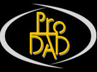

  
  

# proDAD – Eine Geschichte der Innovation

Edition: 2026

## Die Geschichte eines Unternehmens, das aus Neugier entstand

Wenn heute ein professionell produziertes Video über den Bildschirm läuft, wirkt vieles selbstverständlich: Die Kamerabewegungen erscheinen ruhig und präzise, Schriften bewegen sich elegant durchs Bild, die Übergänge wirken fließend, die Farben stimmen, störende Verzerrungen verschwinden und selbst schwieriges Videomaterial lässt sich nachträglich korrigieren. Doch hinter diesen scheinbar mühelosen Ergebnissen stecken Mathematik, Algorithmen, Bildverarbeitung und eine große Menge technischer Detailarbeit. Genau in diesem Spannungsfeld zwischen visueller Gestaltung und hochkomplexer Softwareentwicklung begann die Geschichte von proDAD.

Die Geschichte dieses Unternehmens beginnt nicht mit einem Businessplan, einem Investor oder einer Marktanalyse. Sie beginnt mit einem Jugendlichen, der in einem Kaufhaus vor einem blauen Bildschirm stehen bleibt. Dieser Jugendliche heißt **Holger Burkarth**. Mehr als vier Jahrzehnte später reicht die Entwicklung von den ersten Experimenten auf einem Commodore 64 über den Amiga und die Casablanca-Videosysteme bis zu modernen Verfahren für Videostabilisierung, Rolling-Shutter-Korrektur, Objektverfolgung, optischen Fluss, GPU-Berechnung, 360°-Video und Rauschunterdrückung. Dabei ist die Geschichte der proDAD GmbH auch die Geschichte zweier sehr unterschiedlicher, sich aber ergänzender Persönlichkeiten: **Holger Burkarth**, der technische Probleme bis auf die unterste Ebene durchdringen und in Software umsetzen wollte, und **Andreas Huber**, der die kaufmännische, organisatorische und finanzielle Seite des Unternehmens übernahm. Was beide verband, war die Bereitschaft, etwas zu versuchen, obwohl niemand garantieren konnte, dass es funktionieren würde.

### Das Werkzeugset für Videomacher: Die Produktwelt von proDAD heute

Um zu verstehen, wie proDAD die digitale Videobearbeitung geprägt hat, lohnt sich ein Blick auf das heutige Produktportfolio. Die Anwendungen lösen jeweils spezifische, extrem anspruchsvolle Herausforderungen der modernen Bildverarbeitung und zeichnen sich durch technologische Alleinstellungsmerkmale aus.

*Mercalli* gilt als weltweite Referenz für die Bildstabilisierung. Die Software korrigiert unruhige Aufnahmen, Drohnenruckeln sowie CMOS-Verzerrungen, beispielsweise den Rolling-Shutter-Effekt, mithilfe von Bewegungsvektoren. *Vitascene* bietet für visuelle Veredelungen cineastische Farbfilter, Lichteffekte und fließende Übergänge, die in Echtzeit auf der GPU berechnet werden. *Heroglyph* deckt die typografische Textgestaltung und Reiseroutenanimation ab und bietet Kontrolle über Pfade, Vorspänne, Trailer und Bauchbinden. Mit *Respeedr* gelingen extrem flüssige Zeitlupen und Zeitraffer, da das Programm durch präzise optische Flussanalysen vollkommen neue Zwischenbilder errechnet.

Mit *Defishr* lassen sich Action-Cam-Fisheye-Linsen vollautomatisch entzerren, während *Spherixr* für die Bearbeitung sphärischer 360°-Videos geeignet ist. Im Bereich der intelligenten Bildanalyse setzen *Disguise* und *Hide* Maßstäbe: *Disguise* ermöglicht verlässliches Tracking zur Anonymisierung von Gesichtern, *Hide* entfernt unerwünschte Objekte nahtlos. Schließlich befreit *Denoisr* Low-Light-Aufnahmen von Bildrauschen, ohne feine Details zu opfern.

Alle Lösungen arbeiten sowohl eigenständig als auch als integrierte Plug-ins in allen gängigen professionellen Schnittsystemen.

### Der Architekt im Hintergrund: Ein Blick hinter die Kulissen

Hinter dieser beeindruckenden Produktpalette steht eine außergewöhnliche Erfolgsgeschichte. Gegründet von **Andreas Huber** und **Holger Burkarth**, beruhte das Fundament von proDAD von Beginn an auf einer klaren und effektiven Synergie: Während **Andreas Huber** die kaufmännische und organisatorische Verantwortung übernahm, widmete sich **Holger Burkarth** voll und ganz seiner lebenslangen Leidenschaft – dem tiefen Verständnis dafür, wie Dinge im Innersten funktionieren, und der Umwandlung komplexester technischer Probleme in funktionierende Software.

Was proDAD bis heute im Kern auszeichnet, ist eine fundamentale Besonderheit: **Holger Burkarth** ist die technologische Seele hinter den Produkten. Er agierte nie nur als spezialisierter Teilbereichsentwickler, sondern durchdrang stets das gesamte System – von den zugrundeliegenden mathematischen Gleichungen und Datenstrukturen über prozessornahe Maschinensprache-Programmierungen (Assembler, C++, C#) und GPU-Kernel bis hin zur visuellen Darstellung auf dem Bildschirm.

Diese Biografie erzählt die faszinierende Geschichte eines Pioniers, der vor über vier Jahrzehnten fasziniert vor dem blauen Bildschirm eines Commodore C64 im Kaufhaus stand. Es ist die Geschichte eines Autodidakten, der sich nie von technischen Hürden, fehlendem Kapital oder unzureichender Hardware aufhalten ließ. Wenn ein Werkzeug fehlte, programmierte er es selbst. Wenn ein Prozessor zu langsam war, erfand er neue Algorithmen, um das Unmögliche doch möglich zu machen.

Begleiten Sie uns auf eine Reise durch die Dekaden der Computergeschichte: Vom 8-Bit-Zeitalter der 1980er-Jahre über die glorreichen Amiga-Tage, den riskanten Schritt in die Vollzeit-Selbstständigkeit mit der revolutionären SSA-Technologie (*ClariSSA*), bis hin zu den heutigen Hochleistungs-Algorithmen der modernen Bildverarbeitung.

Es ist die Geschichte von Ausdauer, eisernem Ehrgeiz bei der Verwirklichung visionärer Ideen und dem unermüdlichen Streben nach Innovation: Die Geschichte von **Holger Burkarth** und proDAD.

## Kapitel 1: Der Funke im Kaufhaus – Wie ein blauer Bildschirm eine Lebensreise begann

An einem nasskalten Wintertag im Jahr 1983 befand sich der siebzehnjährige Holger mitten in seiner Ausbildung zum Mechaniker – einem soliden handwerklichen Beruf, bei dem es auf Präzision, Verständnis für Mechanik und das Zusammenspiel beweglicher Teile ankam. Einmal in der Woche besuchte er die Berufsschule und verbrachte wie so oft die Mittagspause mit einigen Mitschülern im nahegelegenen Karstadt-Kaufhaus. Es war der gewohnte Spaziergang zwischen Haushaltswaren und Unterhaltungselektronik, bis Holger abrupt vor einem kleinen Präsentationsstand stehen blieb.

Auf einem einfachen Röhrenfernseher flimmerte ein tiefblauer Bildschirm, auf dem lediglich ein hellblauer Rahmen und die kryptischen Zeilen

`**** COMMODORE 64 BASIC V2 ****`

`64K RAM SYSTEM 38911 BASIC BYTES FREE`

zu sehen waren. Für die meisten Passanten war es eine leblose, unverständliche Anzeige, doch auf Holger übte dieser Anblick eine magische Anziehungskraft aus. In diesem Moment trat ein anderer Besucher an den Stand und begann, auf der braunen Brotkasten-Tastatur zu tippen. Nach wenigen Augenblicken erwachte der Bildschirm zum Leben: Zeilen wanderten über den Monitor, Farben flackerten auf und Töne ertönten. Für Holger war es eine Offenbarung, denn er sah zum ersten Mal einen Mikrocomputer in Aktion – den legendären Commodore 64.

Neu war ihm das Konzept eines Rechners allerdings nicht, da er die leuchtenden Konsolen in Science-Fiction-Filmen mit Begeisterung verfolgt hatte und schon Jahre zuvor von autonomen Systemen fasziniert gewesen war. Als Zwölfjähriger hatte er stundenlang im Quelle-Katalog geblättert, nicht etwa auf der Suche nach Spielzeug, sondern aus reinem Interesse an neuen technischen Geräten, bis sein Blick schließlich fasziniert an einem kleinen, solarbetriebenen Taschenrechner hängengeblieben war. Der hohe Preis ließ den Wunsch jedoch zunächst unerreichbar erscheinen. Als seine Eltern ihm das Gerät schließlich zu Weihnachten schenkten, lernte er mithilfe der Anleitung erstmals trigonometrische Funktionen wie Sinus und Kosinus kennen. Während andere Kinder Matheaufgaben als lästige Pflicht empfanden, entdeckte Holger die Faszination der Mathematik als Sprache zur Beschreibung der Welt.

Mit 13 Jahren folgte sein erstes großes Projekt: Er wollte sein Fahrrad mit einer automatischen Gangschaltung ausstatten. Die Bewegung der Schaltungshebel schien ihm lösbar, doch stellte sich die Frage, wie die Steuerung selbstständig entscheiden sollte, wann hoch- oder runtergeschaltet werden musste. In der Kinder-Wissensreihe *„Wie geht das?”* hatte er gelesen, dass Computer aus logischen Schaltgliedern wie UND- und ODER-Gattern bestehen. Kurzerhand nahm er den A3-Zeichenblock seiner Schule und begann, Gatter für Gatter mit Bleistift und Lineal seinen eigenen Computer zu zeichnen. Zwar war ihm klar, dass er die benötigten Halbleiter niemals selbst zusammenlöten könnte, doch damit war der gedankliche Grundstein gelegt, da er verstehen wollte, wie aus reiner Logik eine Automation entsteht.

Nun stand dieser Traum real vor ihm im Kaufhaus. Die Ausbildungsvergütung als Mechanikerlehrling war bescheiden, und ein Großteil des Geldes ging bereits für die monatliche Busfahrkarte drauf. Dennoch stand sein Entschluss fest: Er musste einen C64 besitzen.

Schon vier Monate vor dem Kauf verbrachte Holger seine Freizeit in der örtlichen Stadtbücherei auf der Suche nach Programmierliteratur. Das Angebot war extrem spärlich, denn lediglich ein dünnes Taschenbuch mit dunkelblauem Einband über die Programmiersprache BASIC war aufzutreiben. Holger verschlang die knapp 50 Seiten und lernte die Befehle auswendig, bevor er überhaupt eine einzige Taste eines echten Rechners berührt hatte.

Im Winter 1984 war es endlich so weit. Das ersparte Geld reichte für einen Commodore 64, doch der Verkäufer versuchte, ihm auch ein Diskettenlaufwerk vom Typ VC1541 zu verkaufen. Da dieses jedoch fast so viel kostete wie der Computer selbst und somit für den Lehrling unerschwinglich war, entschied er sich zähneknirschend für die günstigere Alternative: eine Datasette, die Daten auf handelsüblichen Tonbandkassetten speicherte.

Zuhause angekommen, gab es keinen eigenen Schreibtisch, sodass der C64 im Wohnzimmer direkt an den Fernseher der Familie angeschlossen werden musste. Nach der Rückkehr von der Arbeit gegen 18 Uhr saß Holger auf dem Boden, den Blick starr auf den Bildschirm gerichtet, und tippte Codezeilen. Jeden Abend vor den 20-Uhr-Nachrichten musste die gesamte Apparatur wieder abgebaut und verstaut werden, damit die Eltern ungestört fernsehen konnten. Erst als er von seinen Ersparnissen einen kleinen Schwarz-Weiß-Fernseher kaufen konnte, verlagerte sich sein Reich in sein eigenes Zimmer, wo ein kleiner Tisch, ein Fernseher und der C64 reichten, um stundenlang zu arbeiten.

Die schmerzhaften Grenzen der Datasette zeigten sich sehr bald, da das Speichern und Laden von Programmen gefühlte Ewigkeiten dauerte. Noch schlimmer waren die gefürchteten Abstürze, denn schon ein kleiner Fehler oder eine Stromschwankung löschte die Arbeit unwiederbringlich aus dem flüchtigen RAM-Speicher. Erst im dritten Ausbildungsjahr reichte der etwas höhere Lohn schließlich aus, um die lang ersehnte VC1541-Floppy zu kaufen, wodurch die Ladezeiten erträglich wurden und die Daten sicher auf 5,25-Zoll-Disketten gespeichert werden konnten.

Holger verschlang Fachzeitschriften wie das *„Commodore 64 Magazin”*. Doch obwohl er anfangs in BASIC programmierte, stieß er schnell an Geschwindigkeitsgrenzen. BASIC war eine interpretierte Sprache, die langsam und träge war und sich für komplexe Grafikberechnungen überhaupt nicht eignete. Ein Magazinartikel brachte es auf den Punkt: Um die volle Leistungsfähigkeit des C64-Prozessors MOS 6510 auszuschöpfen, musste man in der Muttersprache des Chips, also in Maschinensprache beziehungsweise Assembler, programmieren.

Da kommerzielle Assembler-Software teuer und für ihn unerschwinglich war, weckte dies Holgers Ehrgeiz: Wenn er sich keinen Assembler leisten konnte, musste er eben selbst einen programmieren. Da er noch keinen Editor hatte, schlug er die Hexadezimal-Codes der Prozessor-Befehle in Handbüchern nach, übersetzte Mnemonics wie `LDA`, `STA` oder `JMP` händisch in Byte-Folgen und berechnete die Sprungweiten für relative Verzweigungen wie `BNE` und `BEQ`, um sein erstes Maschinencode-Programm zu schreiben. Zunächst programmierte er einen einfachen Assembler in BASIC, der zwar langsam war, aber ausreichte, um einen zweiten, wesentlich mächtigeren Assembler zu entwickeln, der vollständig in nativer Maschinensprache geschrieben war. Das war ein entscheidender Meilenstein, da Holger sich sein eigenes Werkzeug erschaffen hatte, das blitzschnell arbeitete und ihm die absolute Kontrolle über die Hardware ermöglichte.

In seinem Umfeld gab es kaum Gleichgesinnte; lediglich zwei Bekannte, Alex und Andreas, besaßen ebenfalls einen C64. Bei ihren Treffen drehte sich alles um Computerspiele und Computergrafik, während Holger für die Technik dahinter brannte. Gemeinsam keimte die Idee auf, ein eigenes Videospiel zu entwickeln, bei dem Alex und Andreas die Grafiken entwerfen sollten, während Holger die technische Engine programmierte.

Mit seinem selbst geschriebenen Assembler entwickelte Holger für damalige Verhältnisse ein flüssig scrollbares Spielfeld, auf dem Objekte präzise positioniert und kollisionsgeprüft werden konnten. Während Holger sich immer tiefer in die Hardwareprogrammierung des Grafikchips VIC-II vertiefte, verlor die Gruppe nach und nach das Interesse und das Projekt verlief im Sande, doch das gewonnene Wissen über Grafikroutinen und Performance-Optimierung sollte sich später noch auszahlen.

Holgers Neugier beschränkte sich nicht auf Software allein, denn er war zutiefst fasziniert von einem Bericht über einen Lichtgriffel – ein Eingabegerät, mit dem man direkt auf der Bildröhre zeichnen konnte, da eine Computermaus für den C64 damals praktisch noch nicht existierte. Nach dem abgedruckten Schaltplan griff er zum Lötkolben, verbaute eine Photodiode in der Spitze eines leeren Kugelschreibers und verdrahtete sie mit dem Control-Port des C64. Wenn der Elektronenstrahl der Bildröhre die Photodiode passierte, löste dies ein Signal aus, das Holger über Software abfing, um die exakte Cursorposition auf dem Bildschirm zu berechnen. Es funktionierte einwandfrei, und der Zeiger folgte der Handbewegung präzise auf dem Glas des Fernsehers.

Berauscht von diesem Erfolg wandte er sich dem nächsten Hardware-Projekt zu, einem selbstgebauten Plotter, der Grafikzeichnungen mit Stiften auf Papier ausgeben sollte. Doch diesmal schlug das Schicksal unbarmherzig zu: Beim Verkabeln der eigenen Platine unterlief ihm ein verhängnisvoller Verdrahtungsfehler, woraufhin ein Kurzschluss durch die Hauptplatine des C64 jagte und empfindliche Custom-Chips zerstörte. Der Bildschirm blieb schwarz, und die Reparaturkosten trieben den jungen Auszubildenden an den Rand des finanziellen Ruins, da sie fast dem Wert eines Neugeräts entsprachen. Es war ein schmerzhafter Dämpfer, der jedoch die klare Entscheidung nach sich zog, sich künftig vorwiegend auf die Softwareentwicklung zu konzentrieren.

Statt aufzugeben, widmete er sich der internen Systemsoftware des C64, schrieb Analyse- und Monitorprogramme sowie Disassembler, um den Speicher des Rechners zu durchleuchten und fremde Programme zu analysieren. Er optimierte die Kernel-Routinen des C64 und entwickelte eigene Fastloader-Algorithmen, welche die serielle Übertragungsgeschwindigkeit zwischen dem C64 und der Floppy VC1541 durch eine abgeänderte Handshake-Strategie erheblich beschleunigten.

Ebenso faszinierten ihn geometrische Berechnungen, etwa wie man Punkte, Linien und einfache 3D-Drahtgittermodelle drehen und in Echtzeit bewegt auf den Bildschirm zeichnen konnte. Dies erforderte auf einem 8-Bit-Prozessor mit nur 1 MHz Taktfrequenz und ohne FPU (Fließkommaeinheit) extrem ausgeklügelte Festkomma-Arithmetik und mathematische Kniffe. Parallel dazu experimentierte er mit dem Soundchip SID (MOS 6581) und programmierte eigene kleine Sound-Editoren, um Musik und Effekte zu synthetisieren.

Was 1983 mit einem staunenden Blick auf einen blauen Bildschirm begann, hatte sich innerhalb weniger Jahre zu einer tiefen, kompromisslosen Leidenschaft entwickelt. Holger hatte nicht nur das Programmieren erlernt, sondern auch, wie man Hardware an ihre absoluten Grenzen treibt, wie man aus minimalen Ressourcen maximale Performance herausholt und wie man komplexe Probleme in eleganten Code übersetzt – womit das Fundament für den späteren Erfolg von proDAD gelegt war.

## Kapitel 2: Der Funke von Fokus-Film und der Aufstieg von Adorage (1987–1991)

Als Commodore im Jahr 1986 mit dem Amiga eine neue Ära des Personal Computers einläutete, wich Holgers Faszination für den C64 rasch dem Drang nach neuen Horizonten. 1987 vollzog er den Wechsel zur fortschrittlichen 16/32-Bit-Architektur des Amigas. Die Grafik- und Soundfähigkeiten des Systems waren für damalige Verhältnisse atemberaubend. Doch Holger begnügte sich nicht damit, die Fähigkeiten der Maschine als Anwender zu nutzen. In akribischer Selbstausbildung lernte er die Custom-Chips des Amigas (Denise, Agnus und Paula) kennen und programmierte eigene 2D- und 3D-Echtzeit-Grafikroutinen. Um die Funktionsweise der digitalen Bildbearbeitung bis ins letzte Bit zu verstehen, schrieb er sogar eine eigene Version der bekannten Malsoftware DPaint nach.

Der entscheidende Wendepunkt folgte im Jahr 1989, als sich in der Nähe seines Wohnorts die Filmproduktionsfirma *Fokus-Film* niederließ. Als Holger von einer speziellen Aufgabenstellung erfuhr, übernahm er in seiner Freizeit freiberuflich einen Entwicklungsauftrag: Er sollte einen spektakulären digitalen Video-Überblendeffekt für deren Produktionen realisieren.

Zu jener Zeit litten Computeranimationen auf Heimrechnern unter störendem Ruckeln und ungleichmäßigen Bildraten. Holger tüftelte intensiv an einer Lösung, um Bewegungsabläufe auf der Amiga-Hardware extrem flüssig und natürlich wirken zu lassen. Innerhalb von nur einer Woche gelang ihm die praktische Umsetzung. Das Ergebnis war eine Video-Transition mit einer visuellen Qualität und Geschmeidigkeit, die auf Heimcomputern bis dahin für unmöglich gehalten worden war. Auch Andreas war von der Leistung hellauf begeistert. Dieser technische Durchbruch ließ bei Holger und Andreas den klaren Entschluss reifen: Aus diesem Potenzial musste ein eigenes Produkt entstehen.

Für das kaufmännische Fundament arbeitete Holger mit seinem langjährigen Freund Andreas Huber zusammen. Sie etablierten eine klare und hochwirksame Arbeitsteilung, die das Unternehmen über Jahrzehnte prägen sollte. Andreas übernahm die gesamte kaufmännische Leitung sowie die Finanzen und die Organisation. Damit schuf er ein geschütztes Umfeld, in dem sich Holger Burkarth ohne administrative Ablenkungen zu einhundert Prozent auf das konzentrieren konnte, was er am besten beherrschte: die Entwicklung wegweisender Softwareprodukte.

Das Unternehmen wurde Anfang 1990 offiziell unter dem Namen proDAD gegründet. Auch das ikonische Firmenlogo trug Holgers unverwechselbare Handschrift. Zu dieser Zeit experimentierte er mit der Ansteuerung eines HP3-Laserdruckers über die integrierte Drawing-Syntax. Anstatt das Logo von Hand zu zeichnen, beschloss er, den Schriftzug aus Kommandos zusammenzusetzen und zu programmieren. Zunächst schrieb er die HP3-Sprache auf dem Amiga nach, um die grafischen Kommandos flexibler nutzen zu können. Für das Logo legte er sich Regeln auf: Die Kontur des Symbols musste aus einer einzigen, ununterbrochenen Linie bestehen, die sich an keiner Stelle überschneiden durfte. So entstand aus diesem logisch-geometrischen Ansatz der prägnante proDAD-Schriftzug, der später um die charakteristischen Flügel und Schatten ergänzt wurde.

Holger begann auf Basis des für Fokus-Film entwickelten Effekts mit der Arbeit an einem eigenständigen Produkt. Die Anwender sollten damit in der Lage sein, Videosequenzen mit beeindruckenden Übergangseffekten zu versehen und diese ruckelfrei abzuspielen. Neben seinem Hauptberuf verbrachte
Holger jede freie Minute mit der Programmierung der Software.

Ende 1990 reisten die beiden Gründer zur Amiga-Messe nach Köln, um ihren Prototypen Branchenkennern vorzuführen. Die Resonanz war gewaltig: Noch auf dem Messegelände kam es zu direkten Gesprächen mit Vertretern von Commodore sowie etablierten Software-Distributoren. Es waren diese Branchenfachleute, die schließlich den passenden Namen für das Debütwerk vorschlugen: *„Adorage”*.

Es folgte ein weiteres Jahr harter Entwicklungsarbeit, bis die Software marktreif war. Zur Amiga-Messe 1991 feierte *Adorage* am Stand des damaligen Vertriebspartners ihre offizielle Premiere. Der Distributor hatte im Vorfeld kistenweise Produktverpackungen produzieren lassen, doch die Nachfrage übertraf alle Erwartungen. Innerhalb von nicht einmal zwei Tagen war der gesamte Lagerbestand restlos ausverkauft. Für den Rest der Messe konnten nur noch handschriftliche Vorbestellungen entgegengenommen werden.

Am Vorführstand bildeten sich dichte Trauben von Besuchern, die gebannt zusahen, wie Holger Burkarth unermüdlich die Leistungsfähigkeit von *Adorage* demonstrierte und technische Details erläuterte. Währenddessen knüpfte Andreas Huber wertvolle Kontakte zu Handelspartnern. Dieses Messeereignis lieferte den endgültigen Beweis für das Marktpotenzial und legte den Grundstein dafür, dass sich proDAD im darauffolgenden Jahr vom Distributor lösen und fortan als unabhängiges Systemhaus agieren konnte.

## Kapitel 3: 1992 – Das Jahr des Wagnisses und die technologische Revolution

Der überwältigende Erfolg von *Adorage* hatte eine Tür aufgestoßen, die sich nicht mehr schließen ließ. Im Jahr 1992 standen die Gründer vor der wegweisenden Entscheidung ihres Lebens: Den sicheren Weg in ihren aktuellen Berufen weitergehen oder das Wagnis eingehen, proDAD fortan in Vollzeit zu führen?

Es war ein Schritt voller Risiken. In der ländlich geprägten Heimat der Gründer waren Computer Anfang der 1990er-Jahre für die meisten Menschen noch „böhmische Dörfer” und die wirtschaftliche Tragweite der Softwareentwicklung kaum greifbar. Das gewohnte Umfeld und auch die eigenen Eltern rieten angesichts der Ungewissheit dringend zur Vorsicht. Doch letztlich siegten der Pioniergeist und der unerschütterliche Glaube an das eigene Können über das Sicherheitsbedürfnis. Mit der pragmatischen Devise „Wir probieren es jetzt für zwei Jahre aus und sehen dann, ob es trägt“ stürzten sie sich in das Abenteuer der Selbstständigkeit.

Die Vision stand fest: Die neuartige Animationstechnik, die Holger in Ansätzen bereits in *Adorage* integriert hatte, sollte zu einem eigenständigen, hochleistungsfähigen System weiterentwickelt werden. Das Ziel war äußerst ehrgeizig: Ein Werkzeug sollte jegliche Animationen in ein neuartiges, extrem flüssiges Format umwandeln und ruckelfrei abspielen können. So kam die SSA-Technologie (Super Smooth Animation) zur Welt. Andreas taufte das geplante Flaggschiff *„ClariSSA“* – ein Name, der die klangliche Eleganz mit der technologischen Überlegenheit der SSA-Engine verband.

Doch der Weg von der Idee bis zum Markteintritt glich einem zermürbenden Kampf gegen technische Grenzen, Zeitnot und die eigene physische Erschöpfung. Während der intensiven Entwicklungsarbeit stieß Holger auf ein fundamentales Hindernis: Die von ihm bisher genutzte Kombination aus **GFA-BASIC** und Inline-Assembler erwies sich für die geplanten hochkomplexen Systemerweiterungen als ungeeignet und zu unflexibel.

In dieser kritischen Phase traf Holger eine radikale und mutige Entscheidung: Er verwarf die bestehende Basis und beschloss, mitten im laufenden Entwicklungsprozess auf ANSI-C umzusteigen. Unter dem unerbittlichen Druck der bevorstehenden Photokina-Messe im September 1992 zwang er sich dazu, eine für ihn völlig neue, hochstrukturierte Programmiersprache im Selbststudium zu erlernen und sie sofort für den Bau eines architektonisch anspruchsvollen Softwareprodukts einzusetzen.

Es folgte eine Phase tiefster sozialer Isolation und extremer Fokussierung. Die Grenzen zwischen Tag und Nacht lösten sich auf. Bis zu 18 Stunden täglich saß Holger vor dem Monitor, um Algorithmen zu schreiben, Speicherstrukturen zu optimieren und C-Code mit hochoptimierten Maschinensprache-Routinen zu verzahnen.

Zu der enormen mentalen und körperlichen Belastung kam existenzielle finanzielle Anspannung hinzu. Die Produktion der hochwertigen Produktboxen und Handbücher verschlang enorme Summen. Als dann eine unerwartete Steuernachzahlung zusammen mit hohen Vorauszahlungen des Finanzamts das Startkapital nahezu vollständig aufzehrte, stand das junge Unternehmen kurz vor dem finanziellen Kollaps. Jede Mark musste zweimal umgedreht werden. Als die Tore der Kölner Messehallen zur Photokina öffneten, stand die wirtschaftliche Existenz von proDAD auf dem Spiel.

Doch bereits am ersten Messetag wandelte sich die lähmende Anspannung in puren Triumph um. Der Messestand von proDAD entwickelte sich zum Publikumsmagneten und wurde von Fachbesuchern geradezu überrannt. Die Messebesucher trauten ihren Augen nicht: Auf den Monitoren liefen Grafik-Animationen mit einer geschmeidigen Perfektion und Bildrate, wie sie bisher nur von extrem teuren Silicon-Graphics-Workstations oder professionellen Kinoproduktionen bekannt waren. Eine digitalisierte Beispielsequenz aus dem Film *„Terminator 2”* sorgte für Furore und lieferte den unumstößlichen Beweis, dass diese Qualität nun auf erschwinglichen Heimcomputern Realität geworden war.

Wie weit proDAD der gesamten Branche voraus war, zeigte sich in einem bemerkenswerten Moment am Messestand: Ein Entwickler des Konkurrenzunternehmens MainConcept, das ebenfalls ein Animations-Tool vorstellte, bat darum, seine eigene Test-Demo versuchsweise über die SSA-Engine abspielen zu dürfen. Als der Manager das Ergebnis auf dem Bildschirm sah, war er derart verblüfft über die flüssige Darstellung, dass er sofort sein gesamtes Entwicklerteam herbeirief. Gemeinsam staunten die Fachleute der Konkurrenz über die technische Leistung – man war sich einig, dass Holger Burkarth hier etwas geschaffen hatte, das die Grenzen der damaligen Hardware scheinbar überschritt.

*ClariSSA* war auf der Messe innerhalb kürzester Zeit restlos ausverkauft. Direkt am Stand musste das Team unzählige Vorbestellungen aufnehmen. Zurück in der Heimat wurden die Firmengründer zu Logistikern: In mühevoller Handarbeit bespielten, etikettierten und bündelten sie hunderte 3,5-Zoll-Disketten mit den gedruckten Anleitungen, verpackten sie in buchgroße Softboxen und brachten diese zur Post, um die Flut der Bestellungen abzuarbeiten.

*ClariSSA* war weit mehr als nur ein wirtschaftlicher Durchbruch. Es zementierte den Ruf von proDAD und Holger Burkarth als technologische Speerspitze für flüssige Video- und Grafikverarbeitung und schuf das Fundament für ein Unternehmen, das in den folgenden Jahrzehnten immer wieder die Grenzen des visuell Machbaren neu definieren sollte.

## Kapitel 4: Monument Titler und die Ära Casablanca – Der Sprung auf dedizierte Hardware (1994–1998)

Nach den beeindruckenden Triumphen von *Adorage* und *ClariSSA* stand die Amiga-Welt Mitte der 1990er-Jahre vor einer dramatischen Umwälzung. Der Mutterkonzern Commodore geriet ins Wanken und musste schließlich Insolvenz anmelden. Während viele Entwickler gelähmt auf den drohenden Niedergang des Amiga-Ökosystems blickten, richtete Holger seinen Fokus unvermindert auf die Weiterentwicklung visueller Werkzeuge. Videoautoren und Amiga-Cutter verlangten längst nicht mehr nur nach flüssigen Übergängen, sondern nach professionellen Titeln, stilvollen Schriften und dynamischen Bild-in-Bild-Effekten.

In diesem dynamischen Marktumfeld nahm 1994 eine neue Vision Gestalt an: Der *Monument Titler*, welcher im späteren Verlauf als *Monument Designer* weiterentwickelt werden sollte. Das erklärte Ziel von Holger war es, ein eigenständiges, mächtiges Titelsystem zu erschaffen, das Texte in bisher unerreichter visueller Qualität direkt auf dem Bildschirm aufbauen und im Raum bewegen konnte.

Die technische Herausforderung bei der hochkarätigen Titeldarstellung war jedoch gewaltig, da sie auf die extrem knappen Hauptspeicherressourcen der damaligen Amiga-Rechner traf. Standardmäßig standen den Systemen oft nur wenige Megabyte Arbeitsspeicher zur Verfügung, in denen Grafikpuffer, Schriftressourcen und Programmcode gleichzeitig Platz finden mussten. Speicherintensive Verfahren schieden daher von vornherein aus. Anstelle rechenintensiver Vektorschriften setzte Holger deshalb auf Bitmap-Fonts. Diese neigten jedoch bei Skalierungen oder Rotationen bauartbedingt rasch zu unschönen, treppenartigen Pixelkanten. Um dieses visuelle Problem grundlegend zu eliminieren, entwickelte er ein Bündel eigenständiger, hocheffizienter Algorithmen.

Zunächst entwarf Holger einen speziellen Anti-Aliasing-Algorithmus zur Kantenglättung über Pixelkonturen, der die Konturen und Kanten der Bitmap-Buchstaben präzise analysierte. Das System berechnete das Kanten-Glätten exakt an den Übergängen der Pixelkonturen, sodass Schriften selbst bei starker Vergrößerung gestochen scharf und ohne störende Ausfransungen erstrahlten. Um Typografie und Grafiken flexibel im Raum zu bewegen, entwickelte er zudem einen extrem schnellen Echtzeit-Shading- und Skalierungs-Algorithmus. Dieser konnte Bitmap-Grafiken um beliebige Winkel drehen und stufenlos skalieren, ohne dass unschöne Treppeneffekte oder visuelle Artefakte entstanden. Trotz der ausgeprägten Speicherarmut der Hardware zeichnete sich dieser Algorithmus durch derart hochoptimierte Speicherzugriffe aus, dass die gesamte Textdarstellung auf der Amiga-Hardware in Echtzeit angezeigt werden konnte. Dies stellte einen unschätzbaren Vorteil für Videocutter dar, die das Ergebnis ihrer Gestaltung sofort auf dem Monitor beurteilen wollten. Mit dem *Monument Titler* legte Holger nicht nur die technologische Basis für das spätere Erfolgsprodukt *Heroglyph*, sondern bewies erneut seine Fähigkeit, fundamentale Hardwaregrenzen durch algorithmische Eleganz zu überwinden.

Das Jahr 1994 markierte für Holger auch in architektonischer Hinsicht einen bedeutenden Meilenstein. Getrieben von seinem unerschöpflichen Wissensdrang und dem Wunsch, Software noch strukturierter und wartbarer zu gestalten, hatte er sich bereits über ein Jahr lang intensiv per Fachliteratur im Selbststudium mit der objektorientierten Programmierung in C++ beschäftigt. Bis dahin fehlte auf der Amiga-Plattform schlicht das passende Werkzeug, um C++ im produktiven Alltag einzusetzen. Dies änderte sich schlagartig mit dem Erscheinen des *Maxon C++ Compilers*, dem ersten wirklich ausgereiften und einsatzfähigen C++-Compiler für das Amiga-System. Holger zögerte nicht und vollzog ab der Entwicklung des *Monument Titler* den vollständigen Umstieg von ANSI-C auf C++. Die Objektorientierung erlaubte es ihm, komplexe Systeme wie Grafik-Engines, Schrift-Objekte und Benutzeroberflächen in wiederverwendbare, saubere Klassenstrukturen zu gießen. Dieses fundierte C++-Wissen sollte in den kommenden Jahrzehnten das stählerne Rückgrat aller zukünftigen Entwicklungen von proDAD bilden.

Während der klassische Heimcomputermarkt für den Amiga nach und nach zusammenbrach, trat das deutsche Unternehmen *MacroSystem* auf den Plan. *MacroSystem* erkannte das ungenutzte Potenzial der Amiga-Architektur für die dedizierte Videobearbeitung und entwickelte ein revolutionäres Hardware-Konzept: Die *Casablanca*, ein eigenständiges Set-Top-Videoschnittsystem für das heimische Wohnzimmer und das semiprofessionelle Videostudio. Die *Casablanca* verzichtete bewusst auf eine klassische PC-Tastatur oder ein komplexes Betriebssystem. Sie wurde direkt an den Fernseher oder Studiomonitor angeschlossen und bequem per Trackball oder Maus bedient. Im Inneren schlug jedoch das Herz bewährter Amiga-Hardware, kombiniert mit spezialisierten Custom-Chips und Festplatten für Digital Video. Für proDAD bedeutete diese neue Hardware-Plattform eine entscheidende Weichenstellung: Weg vom schrumpfenden Hobby-Computermarkt, hin zum stark wachsenden Markt der dedizierten Videoschnitt-Hardware.

Die Anpassung der Software aus dem Hause proDAD auf die *Casablanca* – insbesondere des *Monument Designer* und der beliebten *Adorage*-Effektbibliothek – stellte Holger vor neuartige Herausforderungen. Da auf der *Casablanca* kein Standard-Workbench-Betriebssystem lief, musste er seine C++-Engines und Grafikroutinen so anpassen, dass sie direkt mit der spezifischen Hardware und dem eigens entwickelten *Casablanca*-Betriebssystem *Bogart* kooperierten. Dank des extrem sparsamen Umgangs mit dem Hauptspeicher und der immensen Geschwindigkeit seines Shading-Algorithmus lief der *Monument Designer* auf den *Casablanca*-Geräten zwischen 1997 und 1998 zur absoluten Höchstform auf. Videocutter weltweit nutzten die Software fortan intensiv, um Urlaubsfilme, Dokumentationen und Hochzeitsvideos mit professionellen Titeln, Überblendungen und visuellen Effekten zu veredeln. Der nachhaltige Erfolg auf der *Casablanca* sicherte proDAD nicht nur das wirtschaftliche Überleben in einer turbulenten Umbruchphase der Computerindustrie, sondern bewies erneut die meisterhafte Fähigkeit von Holger, visionäre Ideen durch unermüdlichen Ehrgeiz in funktionierende, marktführende Software umzusetzen.

## Kapitel 5: Die Vision eines neuen Fundaments – Das Abenteuer pOS (1995–1998)

Mitte der 1990er-Jahre zeichnete sich das unausweichliche Ende einer Ära ab. Der schleichende Niedergang von Commodore und die drohende Liquidation des gesamten Amiga-Ökosystems erfüllten viele Entwickler mit tiefer Besorgnis. Für Holger bedeutete dieser dramatische Umbruch jedoch weit mehr als nur den Verlust einer gewohnten Arbeitsumgebung. Über Jahre hinweg hatte ihn die elegante Architektur von AmigaOS fasziniert – ein Betriebssystem, das trotz denkbar minimaler Hardwareanforderungen echtes Multitasking, extrem geringe Latenzen und eine bemerkenswert schlanke Struktur bot. Die unerträgliche Vorstellung, dass diese wegweisenden Ideen und Prinzipien in der Versenkung der Computergeschichte verschwinden sollten, weckte in ihm einen gewaltigen Tatendrang.

Aus diesem inneren Antrieb heraus entwickelte Holger im Jahr 1995 ein beispiellos kühnes Vorhaben: die Erstellung eines eigenen, vollkommen neuartigen Betriebssystems unter dem Namen *pOS*, was für proDAD Operating System stand. Es war ein Projekt von schier gewaltigem Ausmaß, für das im Normalfall die Kapazitäten ganzer Entwicklerteams und Großkonzerne erforderlich gewesen wären. Doch von 1995 bis 1998 setzte sich Holger in unermüdlicher Einzelarbeit daran, dieses Mammutwerk Schicht für Schicht eigenhändig zu programmieren.

Holger entwarf *pOS* als ein modernes, hochmodulares Betriebssystem. Sein erklärtes Ziel war eine weitgehende Kompatibilität zu bestehenden AmigaOS-Konzepten, um Anwendern und Entwicklern einen nahtlosen Übergang zu ermöglichen. Gleichzeitig wollte er die historischen Unzulänglichkeiten der alten Plattform überwinden und ein zukunftssicheres Fundament schaffen, das völlig hardwareunabhängig auf modernen Prozessoren laufen konnte. In zahllosen Tag- und Nachtschichten entwickelte er im Alleingang sämtliche Kernkomponenten des Systems. Den Herzschlag der Software bildete ein präemptiver Multitasking-Kernel mit extrem schnellem Nachrichtenaustausch für die Inter-Process Communication, einer hochoptimierten Speicherverwaltung und einem ausgeklügelten Prozess-Scheduling. Parallel dazu konstruierte er eigene Abstraktionsschichten für Speichermedien und Hardwaretreiber, um das Dateisystem flexibel an unterschiedlichste Prozessorarchitekturen anzupassen. Auch die grafische Benutzeroberfläche hat er von Grund auf selbst entwickelt: Er baute sie effektiv in C++ auf und verankerte ein objektorientiertes Fenstersystem mit vollem Event-Handling, dynamischem Rendering und einer intuitiven Benutzerführung. Für die technische Community war *pOS* eine kleine Sensation, denn Holger bewies eindrucksvoll, dass ein einzelner Entwickler mit eiserner Disziplin, tiefem Systemverständnis und dem kompromisslosen Willen zur Umsetzung in der Lage war, ein funktionierendes, hochperformantes Betriebssystem zu erschaffen.

Holgers unerschütterliche Hoffnung und die treibende Kraft für dieses riesige Unterfangen lagen in seinem tiefen Glauben an die Gemeinschaft. Er war fest davon überzeugt, dass viele talentierte Entwickler und Weggefährten aus der Amiga-Szene die Chance ergreifen würden, um gemeinsam ein neues, unabhängiges Software-Ökosystem auf moderner Hardware zu errichten. *pOS* sollte die technologische Heimat für all jene werden, die den Geist der Amiga-Ära in die Zukunft retten wollten.

Doch im Laufe der Monate und Jahre wich der anfängliche Optimismus einer schmerzhaften Erkenntnis. In zahlreichen intensiven Gesprächen mit anderen Entwicklern, Studios und Branchenkennern stieß Andreas immer wieder auf dieselbe Ernüchterung. Der ursprüngliche Pioniergeist der Computer-Frühzeit hatte sich gewandelt. Statt der Begeisterung für ein gemeinsames, unabhängiges Fundament beherrschte die pragmatische Frage nach dem persönlichen, finanziellen Vorteil fast jedes Gespräch. Die benötigte kritische Masse an Entwicklern und Drittherstellern, die bereit gewesen wäre, Zeit und Ressourcen in die Portierung ihrer Anwendungen für *pOS* zu investieren, kam schlichtweg nicht zustande. Die Einsicht war bitter, aber unausweichlich: Ohne ein breites Software-Ökosystem und ohne eine tragfähige Community hatte ein Betriebssystem im Alleingang keine Überlebenschance am Markt.

Im Jahr 1998 traf proDAD schweren Herzens die strategische Entscheidung, das Projekt *pOS* einzustellen. Auch wenn der Traum vom eigenen Betriebssystem unerfüllt blieb, war die dreijährige Entwicklungsarbeit keineswegs vergebens. Holger hatte durch die meisterhafte Bewältigung dieser Herkulesaufgabe ein unschätzbares Repertoire an Wissen über Systemarchitektur, Speicherverwaltung und objektorientiertes C++-Design erlangt – ein Rüstzeug, das den unumstößlichen Grundstein für die darauffolgenden Erfolge auf dem Windows-PC legen sollte.

## Kapitel 6: Der Zeit voraus – Die Vision der Videotelefonie und das Lehrgeld von Cocktel (1997)

Das Jahr 1997 markierte eine außergewöhnliche Phase, in der proDAD technologisch in Regionen vorstieß, die für die breite Masse der damaligen Computeranwender noch wie reine Science-Fiction anmuteten. Während Holger am Betriebssystem *pOS* tüftelte und die Schnittsoftware auf den Casablanca-Systemen florierte, faszinierte ihn eine völlig neue, scheinbar unlösbare Herausforderung: die synchrone Übertragung von Live-Bild und Ton über eine gewöhnliche analoge Telefonleitung.

Die Grundidee war schlichtweg revolutionär, denn Jahre bevor Breitband-Internet, moderne Videokonferenz-Plattformen oder Smartphones den Alltag eroberten, wollte proDAD Menschen über große Distanzen hinweg visuell miteinander verbinden. Unter dem treffenden Namen *Cocktel* entwickelte Holger ein hochkomplexes Gesamtsystem zur Live-Videotelefonie für den Amiga.

Aus technischer Sicht glich dieses Vorhaben einem gewagten Ritt auf dem Rasiermesser. Die Rahmenbedingungen im Jahr 1997 waren denkbar unbarmherzig, denn anstelle von schnellem DSL oder ISDN standen den Haushalten lediglich gewöhnliche analoge Kupferleitungen mit handelsüblichen Modems zur Verfügung, die maximale Übertragungsraten von mageren 28,8 oder 33,6 kbit/s erreichten. Über diese extrem schmale Bandbreite mussten sowohl das komprimierte Videobild als auch das Audiosignal in Echtzeit übertragen werden, ohne dass die Verbindung abbrach oder die Verzögerung das Gespräch unmöglich machte.

Holger knöpfte sich die mathematischen Grundlagen der Signalverarbeitung und Datenkompression vor. Da fertige Software-Bausteine für diese extreme Notsituation schlichtweg nicht existierten, entwickelte er maßgeschneiderte Algorithmen von Grund auf. Um das Videobild auf wenige Kilobyte pro Sekunde einzudampfen, schrieb er ein intelligentes Differenz-Verfahren. Statt vollständiger Einzelbilder wurden ausschließlich jene Pixelbereiche übertragen, die sich von Frame zu Frame veränderten, was mit einer aggressiven, aber visuell erträglichen Skalierung auf niedrige Auflösungen kombiniert wurde. Parallel zum Bild musste auch das Sprachsignal digitalisiert, durch eine effiziente Audio-Quantisierung stark komprimiert und vollkommen synchrongeschaltet über dieselbe Modemschnittstelle geschleust werden, um einen verlässlichen Lip-Sync zu gewährleisten. Über einen angeschlossenen Video- und Audio-Digitizer fing die Software das analoge Kamerasignal ab, komprimierte es in Windeseile auf dem Hauptprozessor des Amigas und übergab die Datenpakete direkt an die serielle Schnittstelle des Modems. Für technisch versierte Beobachter war *Cocktel* ein algorithmisches Meisterwerk, denn Holger hatte bewiesen, dass synchrone Live-Videotelefonie selbst auf der betagten Amiga-Hardware und über einfache Telefonkabel technisch machbar war.

Im Herbst 1997 präsentierte proDAD das System voller Stolz auf der Kölner Computermesse, doch am Messestand folgte die kalte Dusche. Während frühere Bildeffekt-Software wie *Adorage* oder *ClariSSA* regelrechte Besucherströme anlockte, blieb das Publikumsinteresse an der Videotelefonie nahezu bei null. Das proDAD-Team stand vor einem klassischen Henne-Ei-Problem, das die enttäuschten Messebesucher immer wieder in denselben ernüchternden Satz kleideten: Wen sollte man denn damit überhaupt anrufen, wo doch sonst niemand eine solche Anlage besaß? Ein Kommunikationswerkzeug entfaltet seinen praktischen Nutzen erst dann, wenn eine kritische Masse an Anwendern dieselbe Hardware und Software besitzt. Im Jahr 1997 gab es jedoch weder eine flächendeckende Netzwerkinfrastruktur noch ein Bewusstsein in der breiten Bevölkerung für digitale Video-Kommunikation. Die kostspielige Anschaffung von Kamera-Digitizern und Modems nur für den privaten Plausch war für die meisten Amiga-Anwender schlicht unrentabel, wodurch *Cocktel* zum ersten und einzigen wirtschaftlichen Fehlschlag in der Amiga-Geschichte von proDAD wurde.

Besonders schmerzhaft wurde dieser Rückschlag aus der Retrospektive, als rund sechs Jahre später, im Jahr 2003, das kleine Unternehmen Skype die Welt der Videotelefonie auf dem Windows-PC im Sturm eroberte und wenig später für Milliardenbeträge den Besitzer wechselte. Zu dieser Zeit waren die Voraussetzungen jedoch völlig andere, denn die PCs verfügten über um ein Vielfaches leistungsfähigere Prozessoren, während flächendeckendes ISDN sowie erste DSL-Anschlüsse eine Bandbreite boten, von der Holger 1997 nur hatte träumen können. Die mathematischen und programmiertechnischen Hürden, die Skype im Zeitalter von Gigahertz-Prozessoren zu lösen hatte, waren kaum mehr mit den Pionierleistungen vergleichbar, die Holger Jahre zuvor auf dem Amiga vollbracht hatte. Für Andreas und Holger hatte der Flop von 1997 jedoch eine nachhaltige Konsequenz: Enttäuscht von der mangelnden Marktentschlossenheit verloren sie das Interesse an diesem Segment und wandten sich fortan wieder voll und ganz ihren Kernkompetenzen zu, nämlich der bildgestützten Videobearbeitung, den Titelsegmenten und visuellen Spezialeffekten. Rückblickend erwies sich *Cocktel* als das klassische Beispiel einer kühnen Vision, die ihrer Zeit schlicht um Jahre voraus war. Die technische Machbarkeit war zwar meisterhaft bewiesen, doch die Welt war schlichtweg noch nicht bereit für die Zukunft der Videotelefonie.

## Kapitel 7: Das Ende einer Pionierzeit – Der Abschied vom Amiga und die Neuausrichtung (1998)

Die Jahre zwischen 1990 und 1998 bildeten für proDAD eine Epoche des Aufbruchs, des unbefangenen Ausprobierens und der reinen Faszination an der digitalen Pionierarbeit. Es war ein Zeitalter, in dem die Computerkultur jung war, Grenzen unendlich weit entfernt schienen und wo ein einzelner, hochfokussierter Entwickler mit genialen Algorithmen die etablierte Fachwelt ins Staunen versetzen konnte. In dieser Goldgräberstimmung entstanden aus Holgers Feder zahlreiche kommerzielle Softwarelösungen, die das Amiga-Ökosystem bereicherten und weit über dessen Grenzen hinaus Strahlkraft entwickelten.

Angefangen mit den frühen Erfolgen von *Adorage* und dessen Nachfolgern *Adorage AGA* sowie *Adorage v2* über die revolutionäre SSA-Technologie in *ClariSSA v1*, *ClariSSA v2* und *ClariSSA v3* bewies Holger immer wieder seine Ausnahmestellung in der flüssigen Animationsdarstellung. Ergänzt wurde diese Produktwelt durch spezialisierte Werkzeuge wie den Farb-Quantisierer *Transformer* sowie das Bildkonvertierungs-Tool *Konrad*. Für die professionelle Video-Typografie und Grafikgestaltung schuf er den mächtigen *Monument Titler v1* und *Monument Titler v2*, aus dem schließlich der *Monument Designer v1* und *Monument Designer v2* für die Amiga-, Draco- und Casablanca-Plattformen hervorging.

Doch Holgers Entwicklungsdrang kannte keine Systemgrenzen: Mit *Animage* entwickelte er einen Echtzeit-Compositing-Videoeditor, während Werkzeuge wie *CAVIN* die automatische Camcorder-Steuerung im Videoschnitt revolutionierten. Selbst Infrastruktur- und Kommunikationslösungen wie das serielle Netzwerk-Tool *pNet*, die Videotelefonie-Software *Cocktel* und schlussendlich das ehrgeizige Betriebssystem-Projekt *pOS* entstammten in dieser Ära seiner Feder.

Bis zuletzt hielten Andreas und Holger an der Hoffnung fest, dass der Amiga durch Rettungsversuche oder neue Eigentümer eine Zukunft haben würde. Doch das Fehlmanagement des Mutterkonzerns Commodore und das Ausbleiben einer klaren Hardware-Strategie forderten schlussendlich ihren unerbittlichen Tribut. Im Jahr 1998 war die Realität nicht mehr wegzudiskutieren: Das einst so stolze Amiga-Ökosystem war endgültig Geschichte.

Für proDAD bedeutete dieser Einschnitt einen dramatischen Wendepunkt. Das Fundament, auf dem das Unternehmen gewachsen war und seine ersten großen Erfolge gefeiert hatte, existierte nicht mehr. Um das wirtschaftliche Überleben zu sichern und die gesammelte technologische Kompetenz in die Zukunft zu retten, mussten sich Andreas und Holger vollkommen neu aufstellen. Ihr Blick richtete sich auf eine neue Architektur, ein neues Betriebssystem und einen Markt, der nach eigenen Regeln funktionierte: den Windows-PC. Ein neues Kapitel der Firmengeschichte stand bevor.

### Links
- [Produkt Timeline](ProductTimeline.de-DE.md)
- [Media / Awards](Media.md)
- [proDAD Website](https://www.prodad.com/)
- [LinkedIn](https://www.linkedin.com/in/holger-burkarth)
- [Youtube](https://www.youtube.com/@SUBIDIDU)
